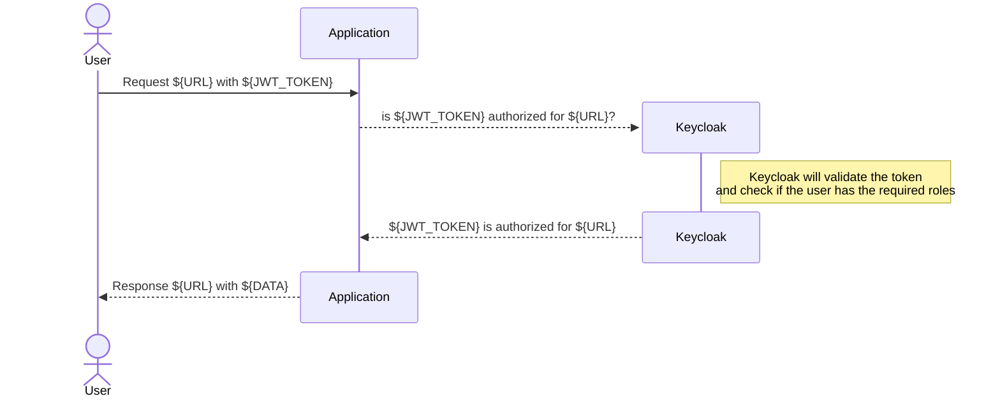

# Rails Keycloak Authorization

Rails middleware to authorize requests using [Keycloak](https://www.keycloak.org) and gem [keycloak-admin-ruby](https://github.com/looorent/keycloak-admin-ruby).

Utilising [Keycloak authorization services](https://www.keycloak.org/docs/latest/authorization_services/index.html#_service_overview).
This gem uses JWT token to authorize requests.
For the moment it only support permission_resource_format=uri.
It does not support rails cookie based sessions, so it is only suitable for APIs.

To use this gem for to protect JWT token & skip cookie based sessions, you may choose on of:

1. Skip authorization for non JWT token request using an environment variable
2. Use regular expressions to match targeted URLs for protection, skip the rest
3. Use regular expressions to match all if all your requests are JWT token based

## How it works

This gem is a middleware that checks if the request is authorized by Keycloak. 
It will check if the request's token is valid and if the user has the required roles to access the requested resource.

Keycloak setup for authorization has many options, the following conventions were followed building this gem:

| Rails component   | Keycloak component  |
|-------------------|---------------------|
| Controller        | Authz Resource      |
| Controller Action | Authz Scope         |
| Route             | permission subject  |


## Flow




## Configuration

In order to use this gem, you need to configure it in an initializer file. You can create a new file in `config/initializers` with the following content:

```ruby
# The Keycloak realm 
RailsKeycloakAuthorization.keycloak_realm = ENV.fetch("KEYCLOAK_AUTH_CLIENT_REALM_NAME", "dummy")
# The client id in the realm
RailsKeycloakAuthorization.client_id = ENV.fetch("KEYCLOAK_AUTH_CLIENT_ID", "dummy-client")
# Keycloak server url
RailsKeycloakAuthorization.keycloak_server_url = ENV.fetch("KEYCLOAK_SERVER_URL", "http://localhost:8080")
# Patterns that are protected by the middleware
RailsKeycloakAuthorization.match_patterns = [
  /^\/organizations(\.json)?/,
  /^\/api/,
  /internal/
]
```

## How to easily test it?

Create development environment with Keycloak and Tofu:
 * checkout the source-code of this project
   * `git checkout https://github.com/tillawy/rails_keycloak_authorization.git`
   * `cd rails_keycloak_authorization`
 * Run keycloak in a [Docker](https://docs.docker.com/get-docker/) container
   * `cd docker`
   * `docker-compose up`
   * verify keycloak is running at `http://localhost:8080`, username: `admin`, password: `admin`
 * Run tofu to setup keycloak realm & client
   * `brew install opentofu`  
   * `cd ../tofu` 
   * `tofu -chdir=tofu init`
   * `tofu -chdir=tofu apply -auto-approve` 

Running the previous steps should:
 * Start Keycloak server
 * Create realm called: `Dummy`
 * Create openid-client called: `dummy-client` in realm `dummy` with:
   * client secret `dummy-client-super-secret-xxx`
   * valid_redirect_uri `http://localhost:3000/*`
 * Create user `test@test.com` with password `test`
 * Create openid-client called: `keycloak-admin` in realm `master` with:
   * client secret `keycloak-admin-client-secret-xxx`
   * role to manager users in realm `dummy`

Run the server:

  `bundle exec rails s`

make the first request (should fail) `Authorization Failed`:

```shell
bash test/curl/test.curl.bash
```

How let us setup Authorization:

 * Open rka http://localhost:3000/rka/management/
 * On the first tab `Rails Routes`
 * The first route `/organizations(.:format)`, click inspect
 * Click on `Create Resource?` to create Authz Resource for controller 
 * Click on `Create Scope?` to create resource for controller action
 * Click on `Attach scope index to resource` to attach the scope (action: index) to the resource (controller: organizations_controller)
 * Select the second tab `Keycloak Policies`
 * From the Role dropdown list select `default-roles-dummy`
 * Click `Create`
 * Select the third tab `Keycloak Permissions`
 * From the Policy dropdown list select `RKA-Policy`
 * From the Resource dropdown list select `organization_controllers`
 * Another dropdown will appear Select Scope, select `index`
 * Click `Create`

Now let us run the test `bash test/curl/test.curl.bash` again, it should pass.

## Installation
Add this line to your application's Gemfile:

```ruby
gem "rails_keycloak_authorization"
```

And then execute:
```bash
$ bundle
```

## Keycloak Manual Setup

#### Enable Client Authorization
* Create a Realm called: `dummy`
* Within the new Realm, create an `OpenID Connect` client
   * id: `dummy-client`
   * name: `Dummy`
   * Client-Authentication: true
   * Authorization: true
   * Root URL: http://localhost:3000
   * valid_redirect_uris: http://localhost:3000/*
* Go to client  `http://localhost:8080/admin/master/console/#/dummy/clients`
   * Under Capability config enable: Authorization
* Go to `Authorization` tab
* Enable `Service Accounts Enabled`
* Add `confidential` role to the client
* Add `confidential` role to the user `

## Contributing
Contribution directions go here.

## License
The gem is available as open source under the terms of the [MIT License](https://opensource.org/licenses/MIT).
