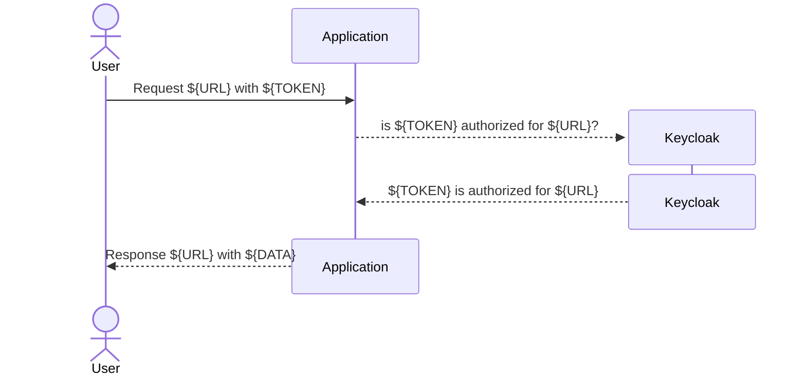

# Rails Keycloak Authorization

Rails middleware to authorize requests using [Keycloak](https://www.keycloak.org).

## How it works

This gem is a middleware that checks if the request is authorized by Keycloak. 
It will check if the request's token is valid and if the user has the required roles to access the requested resource.



## Configuration

In order to use this gem, you need to configure it in an initializer file. You can create a new file in `config/initializers` with the following content:

```ruby
# The Keycloak realm 
RailsKeycloakAuthorization.keycloak_realm = ENV.fetch("KEYCLOAK_AUTH_CLIENT_REALM_NAME", "dummy")
# The client id in the realm
RailsKeycloakAuthorization.client_id = ENV.fetch("KEYCLOAK_AUTH_CLIENT_ID", "dummy-client")
# Keycloak server url
RailsKeycloakAuthorization.keycloak_server_url = ENV.fetch("KEYCLOAK_SERVER_URL", "http://localhost:8080")
# Patterns that are protected by the middleware
RailsKeycloakAuthorization.match_patterns = [
  /^\/organizations(\.json)?/,
  /^\/api/,
  /internal/
]
```


## Usage
in order to use the middleware, you need to setup keycloak.


## Installation
Add this line to your application's Gemfile:

```ruby
gem "rails_keycloak_authorization"
```

And then execute:
```bash
$ bundle
```

Or install it yourself as:
```bash
$ gem install rails_keycloak_authorization
```

## Contributing
Contribution directions go here.

## License
The gem is available as open source under the terms of the [MIT License](https://opensource.org/licenses/MIT).
